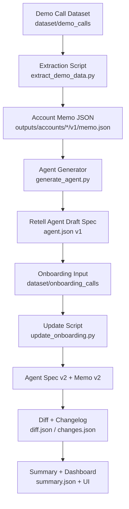

# Clara Agent Automation Pipeline

## Overview
This project builds a zero-cost automation pipeline that converts demo and onboarding call transcripts into structured AI voice agent configurations.

The system processes demo transcripts to generate a preliminary Retell agent configuration (v1) and updates it after onboarding to produce a refined configuration (v2).

## System Architecture

The pipeline processes demo and onboarding transcripts to generate and update AI voice agent configurations.

Demo Call Transcript
→ Data Extraction
→ Account Memo JSON
→ Agent Configuration (v1)
→ Storage

Onboarding Transcript
→ Update Rules
→ Memo Update
→ Agent Version v2
→ Changelog

## How to Run

Clone the repository:
git clone https://github.com/sakshiikumarr/clara-agent-pipeline.git  
cd clara-agent-pipeline

Navigate to the scripts folder:
cd scripts

Run the automation pipeline:
python run_pipeline.py

This pipeline will automatically:

1. Ingest demo call transcripts from `dataset/demo_calls`
2. Extract structured business information into **Account Memo JSON**
3. Generate an initial **Retell Agent configuration (v1)**
4. Process onboarding transcripts from `dataset/onboarding_calls`
5. Apply updates and generate **Agent configuration v2**
6. Produce **diff and changelog files** showing updates between v1 and v2
7. Generate **summary metrics and task tracker outputs**

All generated outputs are stored in:
outputs/accounts/

Each account contains versioned configurations:
outputs/accounts/demoX/
   v1/
   v2/

A summary report is also generated:
outputs/summary.json

To view the simple dashboard UI, open:
dashboard/index.html

## n8n Orchestration

An n8n workflow is provided in `/workflows/n8n_workflow.json`.

The workflow contains:
Manual Trigger → Execute Command → python scripts/run_pipeline.py

This acts as the orchestration layer for running the automation pipeline.

## Key Design Decisions

- Rule-based extraction to maintain zero cost
- No hallucination of missing data
- Version control for agent configuration
- Structured JSON outputs for reproducibility

## Limitations

- Extraction logic is keyword-based
- Real deployment would use an LLM for more robust parsing
- Retell API integration is simulated via JSON agent spec

## Future Improvements

- Use local LLM for structured extraction
- Add UI dashboard for account management
- Add visual diff viewer for version updates
