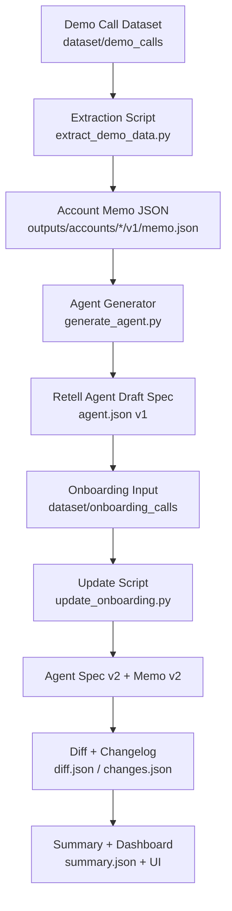

# Clara Agent Automation Pipeline

## Overview
This project builds a zero-cost automation pipeline that converts demo and onboarding call transcripts into structured AI voice agent configurations.

The system processes demo transcripts to generate a preliminary Retell agent configuration (v1) and updates it after onboarding to produce a refined configuration (v2).

## System Architecture

The pipeline processes demo and onboarding transcripts to generate and update AI voice agent configurations.

Demo Call Transcript
→ Data Extraction
→ Account Memo JSON
→ Agent Configuration (v1)
→ Storage

Onboarding Transcript
→ Update Rules
→ Memo Update
→ Agent Version v2
→ Changelog

## Folder Structure

dataset/
demo_calls/
onboarding_calls/

outputs/
accounts/
account_id/
v1/
memo.json
agent.json
v2/
memo.json
changes.json
diff.json

scripts/
create_tasks.py
diff_versions.py
extract_demo_data.py
generate_agent.py
generate_summary.py
update_onboarding.py
run_pipeline.py

workflows/
n8n_workflow.json

config.json

## n8n Orchestration

An n8n workflow is provided in `/workflows/n8n_workflow.json`.

The workflow contains:
Manual Trigger → Execute Command → python scripts/run_pipeline.py

This acts as the orchestration layer for running the automation pipeline.

## How to Run

Navigate to the scripts folder and run:
python run_pipeline.py

This will:
1. Process demo transcripts
2. Generate agent configurations
3. Apply onboarding updates
4. Produce versioned outputs

## Key Design Decisions

- Rule-based extraction to maintain zero cost
- No hallucination of missing data
- Version control for agent configuration
- Structured JSON outputs for reproducibility

## Limitations

- Extraction logic is keyword-based
- Real deployment would use an LLM for more robust parsing
- Retell API integration is simulated via JSON agent spec

## Future Improvements

- Use local LLM for structured extraction
- Add UI dashboard for account management
- Add visual diff viewer for version updates
